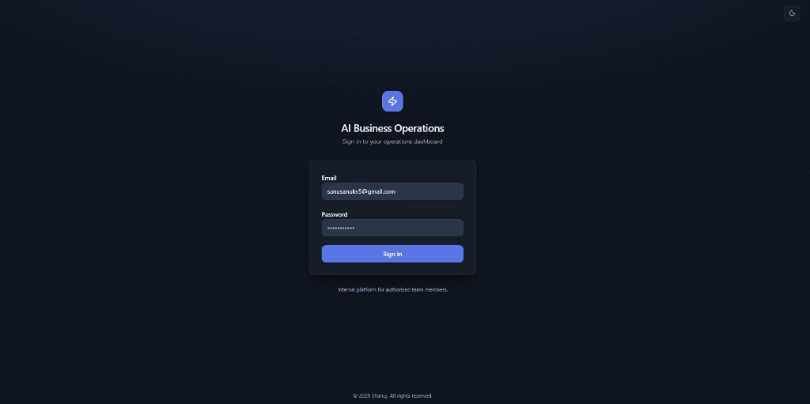
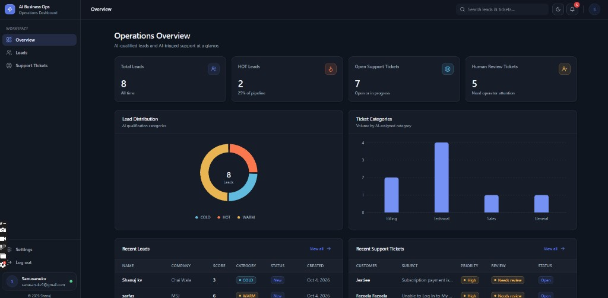
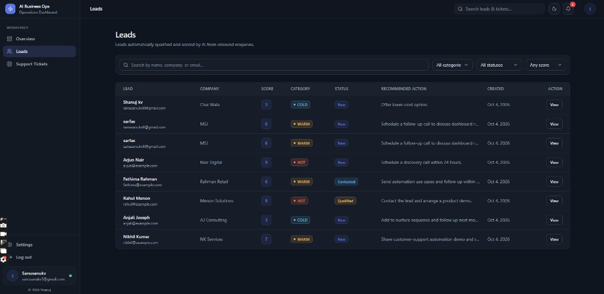
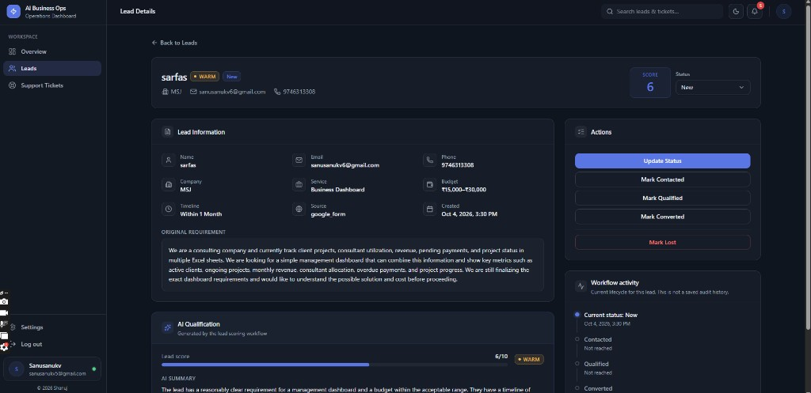
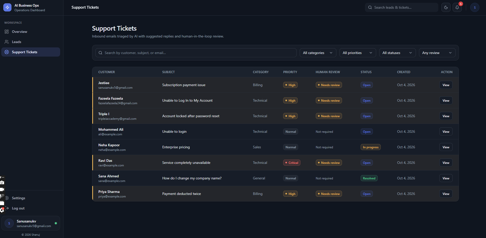
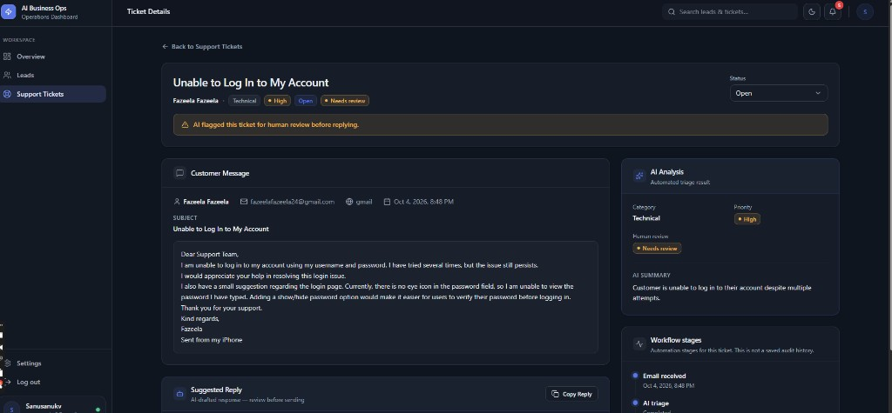
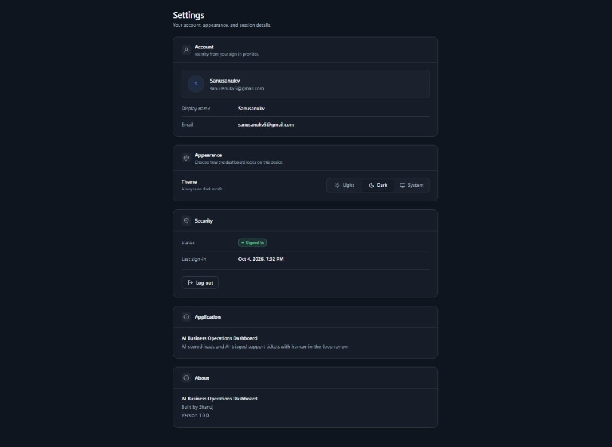
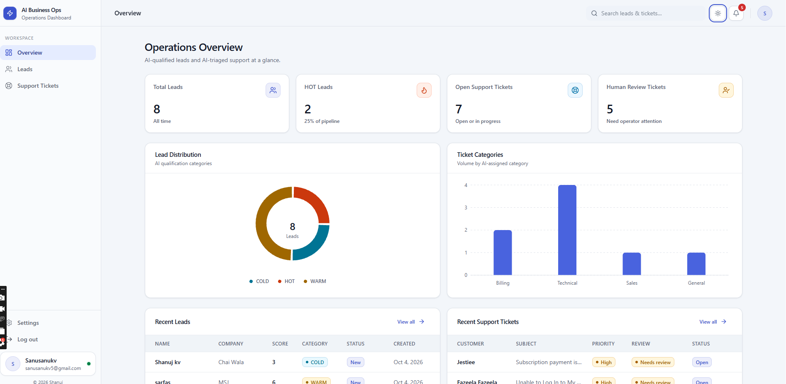

# AI Business Operations Dashboard

Internal operations dashboard for reviewing AI-qualified sales leads and AI-triaged customer support tickets. Intake stays in n8n and OpenAI. The dashboard reads the results from Supabase and lets an operator search records, update status, and follow tickets that need a person.

**Built by Mohammed Shanuj**

## Project overview

Sales enquiries and support messages are collected outside the app, classified by an automation workflow, and stored in PostgreSQL. Signed-in operators use this dashboard to see pipeline health, open a lead or ticket, and persist a status change.

The interface covers an operations overview, lead and support lists, detail pages, global search, a notification bell for unresolved human-review tickets, and light, dark, and system themes. Routes behind sign-in are protected. The browser talks to Supabase with the publishable key only.

## Live demo

Production: [https://ai-business-automation-dashboard.vercel.app](https://ai-business-automation-dashboard.vercel.app)

Repository: [https://github.com/Mohammedshanuj/ai-business-automation-dashboard](https://github.com/Mohammedshanuj/ai-business-automation-dashboard)

Sign-in uses an existing Supabase Auth user. Public self-signup is not part of this app.

## Screenshots

### Sign in



Email and password sign-in for authorized operators. Unauthenticated visitors are sent here before they can open the dashboard.

### Operations overview



Live operations dashboard showing lead qualification metrics, support workload, charts, and recent activity.

### Leads



Inbound enquiries with an AI score, HOT / WARM / COLD category, status, and a recommended next action.

### Lead qualification



AI-qualified lead detail with score, HOT/WARM/COLD category, summary, recommended action, and original business requirement.

### Support tickets



Inbound emails triaged by AI, with category, priority, human-review flag, and status.

### Support triage



AI-triaged support ticket showing category, priority, human-review flag, AI summary, and suggested response.

### Settings



Account and session details, plus light, dark, and system theme stored on the device.

### Light theme



The same operations overview in light theme. Appearance follows the operator’s light, dark, or system choice.

## Architecture

```text
Google Forms / Gmail
        ↓
       n8n
        ↓
     OpenAI
        ↓
    Supabase
        ↓
 React dashboard
```

1. A Google Form submission or a Gmail message enters n8n.
2. n8n sends the content to OpenAI for qualification or triage.
3. n8n writes the structured result into Supabase.
4. The React app loads those rows for signed-in operators and writes status updates back to the same tables.

The dashboard does not call OpenAI. Scoring and triage run in the automation layer. The UI loads current rows with TanStack Query when a page opens, when a failed request is retried, and after a status update is saved.

## Features

- Email and password sign-in with Supabase Auth
- Protected routes that send unauthenticated visitors to the sign-in page
- Operations overview with lead and ticket metrics, distribution charts, recent records, and an operator summary
- Lead list and detail pages with score (1–10), HOT / WARM / COLD category, AI summary, and recommended action
- Support list and detail pages with category, priority, human-review flag, AI summary, and suggested reply
- Persistent lead and ticket status updates
- Search across leads (name, company, email) and support tickets (customer, subject, email)
- Notification bell for unresolved tickets flagged for human review
- Light, dark, and system theme, stored on the device
- Responsive layout for desktop and smaller screens

Lead statuses: New, Contacted, Qualified, Converted, Lost.

Support statuses: Open, In progress, Waiting on customer, Resolved, Closed.

Support categories: Billing, Technical, Sales, General.

Support priorities: Critical, High, Normal.

## Tech stack

| Area | Choice |
| --- | --- |
| UI | React 19, TypeScript, Tailwind CSS, Radix UI (shadcn-style components) |
| App framework | Vite, TanStack Start, TanStack Router |
| Data fetching | TanStack Query |
| Charts | Recharts |
| Database and auth | Supabase PostgreSQL, Supabase Auth |
| Automation | n8n, OpenAI |
| Hosting | Vercel |

## Database and security

Operational data lives in two Supabase tables, `leads` and `support_tickets`. Both are protected with Row Level Security. The dashboard reads and updates rows with the signed-in user’s session.

The browser is configured with only:

- `VITE_SUPABASE_URL`
- `VITE_SUPABASE_PUBLISHABLE_KEY`

The publishable key is safe to ship in the client because access is limited by Auth and RLS. The Supabase service-role key, OpenAI API key, and n8n credentials must stay on the server side of those services. Do not put them in Vite environment variables, client code, or this repository.

## AI automation workflows

**Lead qualification.** A Google Form response reaches n8n, which can also sync the sheet. OpenAI scores the enquiry from 1 to 10, assigns HOT, WARM, or COLD, and returns a summary and recommended action. n8n stores the enquiry and that result on `leads`.

**Support triage.** A Gmail message reaches n8n. OpenAI assigns a category and priority, sets whether a person should review it, and returns a summary and suggested reply. n8n stores the message and that result on `support_tickets`, including the Gmail message id when one is available.

Operators review those fields in the dashboard. Status changes are saved in Supabase and reflected in the lists, detail pages, overview, and notification bell after the update succeeds.

## Local setup

Requirements: Node.js (current LTS) and npm.

```sh
git clone https://github.com/Mohammedshanuj/ai-business-automation-dashboard.git
cd ai-business-automation-dashboard
npm install
cp .env.example .env.local
```

Fill in `.env.local` (see below), then start the dev server:

```sh
npm run dev
```

Vite prints the local URL. Sign in with a Supabase Auth user that can read the RLS-protected tables.

## Environment variables

Copy `.env.example` to `.env.local` for local development. Set the same two variables in the Vercel project for production.

| Variable | Purpose |
| --- | --- |
| `VITE_SUPABASE_URL` | Supabase project URL |
| `VITE_SUPABASE_PUBLISHABLE_KEY` | Supabase publishable (anon) key |

```sh
VITE_SUPABASE_URL=
VITE_SUPABASE_PUBLISHABLE_KEY=
```

Do not add the service-role key, an OpenAI key, or n8n credentials to the client environment. Those belong in Supabase and n8n, not in the dashboard.

## Testing and build

```sh
npm test
npm run build
```

`npm test` runs Vitest. The suite currently has **13 passed** tests, covering dashboard metrics, theme preference, user display, and routing.

`npm run build` produces the production bundle. The production build **passed**.

Other scripts:

| Command | Purpose |
| --- | --- |
| `npm run dev` | Local development server |
| `npm run preview` | Preview the production build locally |
| `npm run lint` | ESLint |
| `npm run format` | Prettier |

## Deployment

The app is deployed on Vercel as a TanStack Start project.

Production: [https://ai-business-automation-dashboard.vercel.app](https://ai-business-automation-dashboard.vercel.app)

Vercel needs `VITE_SUPABASE_URL` and `VITE_SUPABASE_PUBLISHABLE_KEY`. Redeploy after changing them. Automation secrets stay in n8n and Supabase.

## Future improvements

- Supabase Realtime so new leads and tickets appear without a manual refresh
- Role-based access for operators and admins
- Server-side pagination and filtering as volume grows
- Broader automated coverage around auth and status mutations
- In-app editing of notes, with an audit trail of status changes

## Author

Built by Mohammed Shanuj

- GitHub: [https://github.com/Mohammedshanuj/ai-business-automation-dashboard](https://github.com/Mohammedshanuj/ai-business-automation-dashboard)
- Production: [https://ai-business-automation-dashboard.vercel.app](https://ai-business-automation-dashboard.vercel.app)
